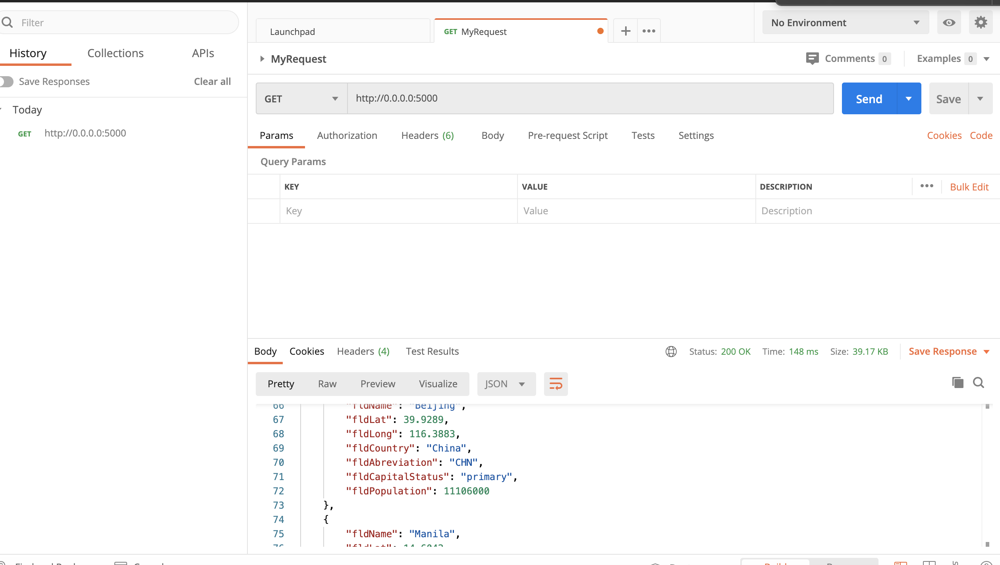
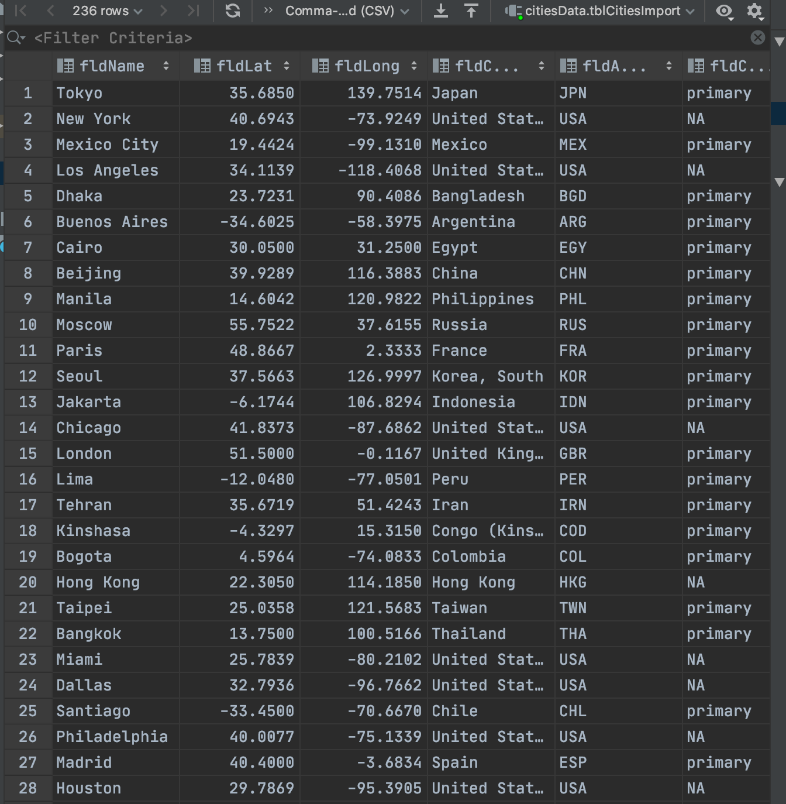

# FINAL PROJECT 
#This project is a homework assignment to teach how to get Pycharm setup with Docker, Flask, MySQL, and Postman

## Word Document w/ Screen Shots (_downloadable_):

* [ASSIGNMENT 3 (pycharm & localhost:5000): D/L word doc w/ screenshots. ](suarez_is218.docx)
* [ASSIGNMENT 4 (postman): D/L word doc W/ screenshots.](suarez_postman.docx)

## Screenshots (_also found in the above word documents_):
* database 
* home 
* data 
* new data 
* added data 
* deleted data 
* postman 
* get 
* post
* new  
* put  
* delete  
### Project Description
This project is a homework assignment to teach how to get Pycharm setup with Docker, Flask, MySQL, and Postman

[Download Assignment PDF Here](PPFSQL-Homework.pdf)

[View Assignment Video Here](https://youtu.be/QbMWNgrfAFg)

### SCREENSHOTS FROM ASSIGNMENTS 1 & 2 FOUND BELOW:

##### Postman Screenshot

##### SQL Data Screenshot

##### Bootstrap Screenshot

##### Readings
* [What is an HTTP API?](https://www.smashingmagazine.com/2018/01/understanding-using-rest-api/)
* [What is JSON?](https://www.w3schools.com/whatis/whatis_json.asp)
* [What is SQL?](http://www.sqlcourse.com/intro.html)
* [What is MySQL](https://www.hostinger.com/tutorials/what-is-mysql)
* [What is Docker Compose?](https://www.tutorialspoint.com/docker/docker_compose.htm)
* [What is Flask?](https://en.wikipedia.org/wiki/Flask_(web_framework))
##### Useful Links
* [Flask Homepage and Documentation](https://flask.palletsprojects.com/en/1.1.x/)
* [JSON Spec Reference](https://www.json.org/json-en.html)
* [SimpleJSON Reference](https://simplejson.readthedocs.io/en/latest/)
* [W3 Schools SQL Tutorial and Reference](https://www.w3schools.com/sql/)

